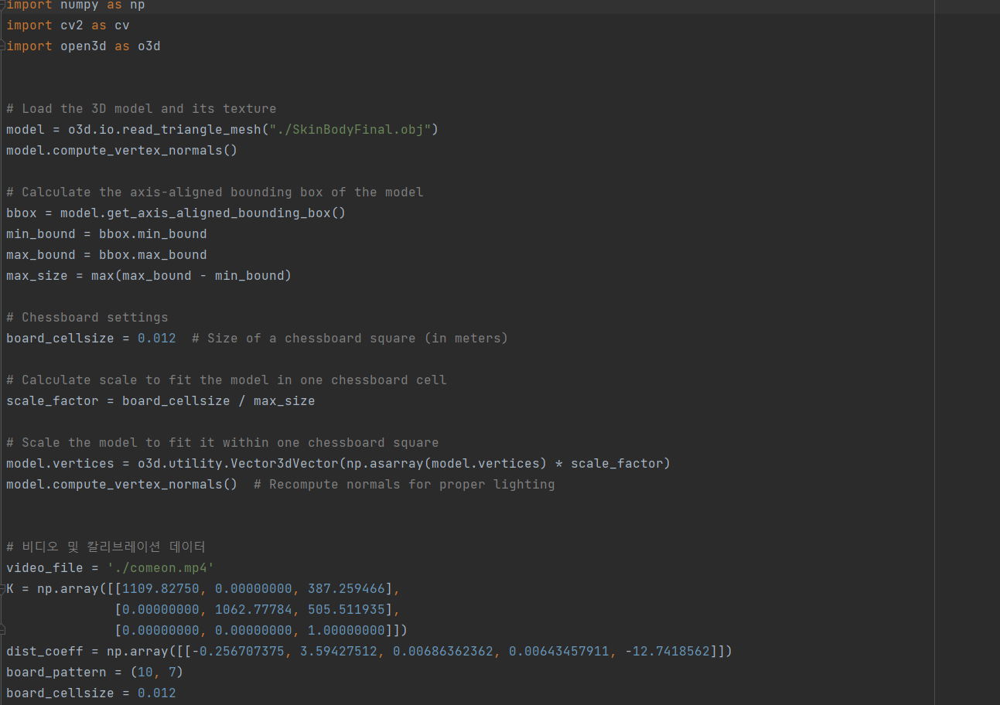
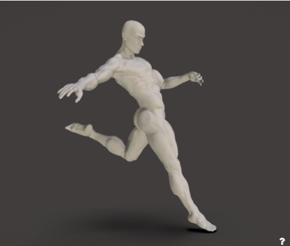
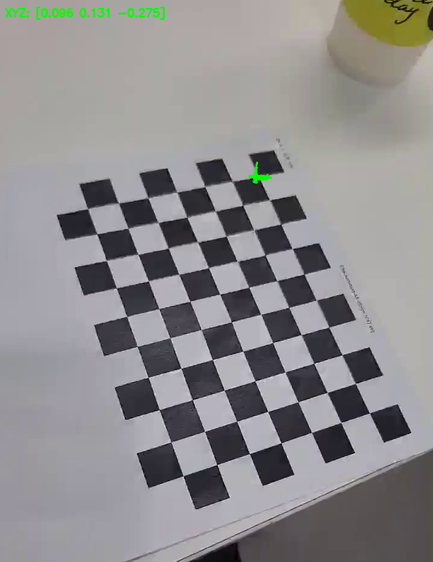

# My simple webcamera recoder

 
 
 
 

## 배경

 수업시간에 배운 openCV를 활용해서 간단한 myfirstAR를 만들어보았습니다.
 
 
 

## 설명

myfirstAR.py 파일을 열어 여기서 코드를 실행합니다.

카메라 calibration을 진행한 영상에서 체스보드 판위에 위 이미지를 AR로 구현합니다.

체스보드 판 위에 해당  3D 모델을 구현하였습니다.

 

## 참고

* GPT4

* CV수업자료

   

