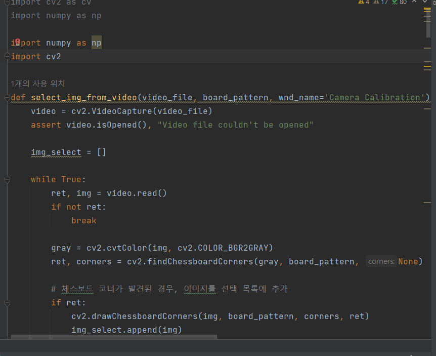
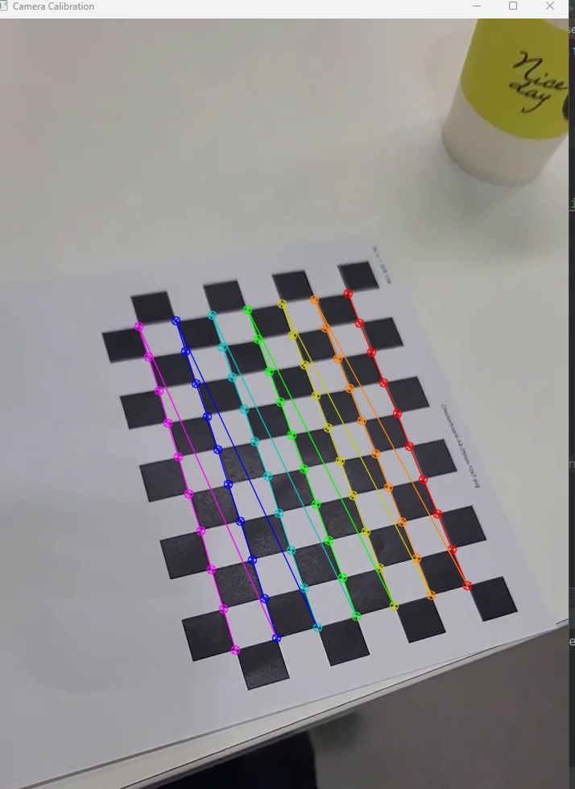
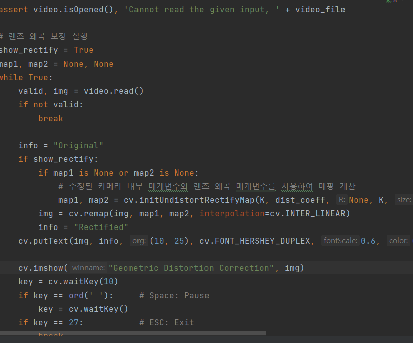
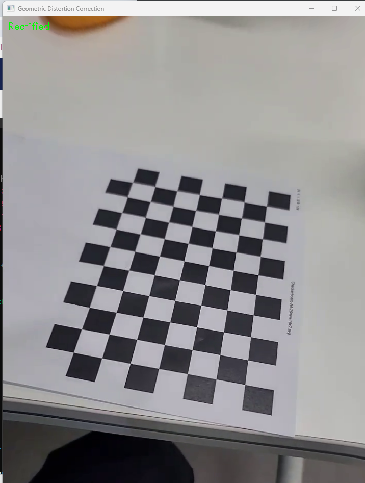

# Myfirst_cameracalibration and Myfirst_distortion_correction
 
 
 

## 배경

 수업시간에 배운 openCV를 활용해서 간단한 Myfirst_cameracalibration and Myfirst_distortion_correction를 만들어보았습니다.
 
 
 

## 설명

  
Myfirst_cameracalibration 파일에서 코드를 실행합니다.

  
  
  

  
calibration 한 결과입니다.

카메라 내부 매개 변수 (행렬 형태):
[[1.10982750e+03 0.00000000e+00 3.87259466e+02]
 [0.00000000e+00 1.06277784e+03 5.05511935e+02]
 [0.00000000e+00 0.00000000e+00 1.00000000e+00]]

카메라 내부 매개 변수:
(fx, fy, cx, cy, ..., rmse): (1109.8275049587737, 1062.7778385509005, 387.2594663941884, 505.511935349457, ..., 1.6154041081141675)

렌즈 왜곡 매개 변수:
[[-2.56707375e-01  3.59427512e+00  6.86362362e-03  6.43457911e-03
  -1.27418562e+01]]

 
 

 
 

 
Myfirst_distortion_correction 파일에서 코드를 실행합니다.
 

 
왜곡이 수정된것을 확인 할 수 있습니다.

 

## 참고

* GPT4

* CV수업자료

   

