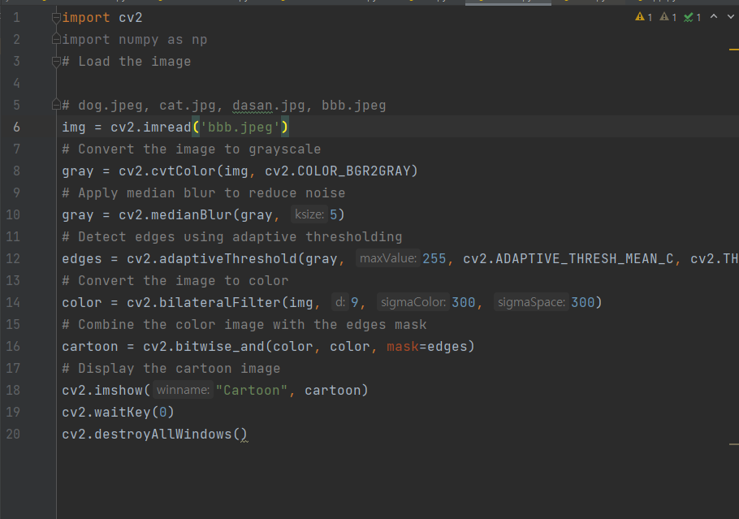
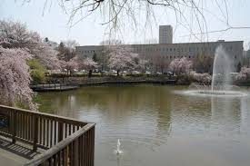
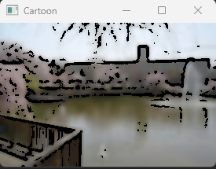
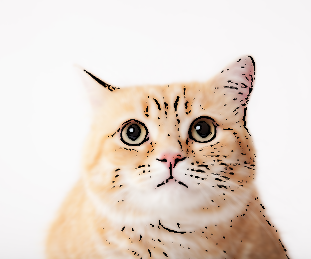
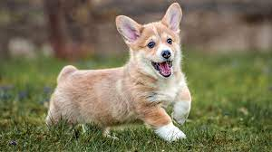
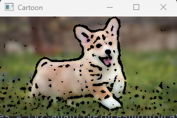

# My cartoon converter
 
 
 
 

## 배경

 수업시간에 배운 openCV를 활용해서 간단한 cartoon converter를 만들어보았습니다.
 
 
 

## 설명

여기서 코드를 실행합니다.
dog.jpeg은 강아지 사진
 cat.jpg은 고양이 사진
 dasan.jpg은 다산관 사진
 bbb.jpeg은 붕어방 사진입니다.
  
  
  

 
 

붕어방 사진과 고양이 사진이 잘 카툰화 된것을 확인할 수 있습니다.

 
 
 
 

 
 

강아지 사진의 카툰화가 조금 무섭게 된것을 확인 할 수 있습니다.

## 결과
알고리즘 고찰

강아지 사진과 붕어방 사진을 비교하였을 때,
배경과의 차이가 너무 두드러지는 경우 너무 엣지를 강조하여 오히려 카툰화에 실패하는 경향을 볼 수 있습니다.
배경과의 차이가 적다면 좋을 결과가 나옵니다.

 

## 참고

* GPT4

* CV수업자료

   

